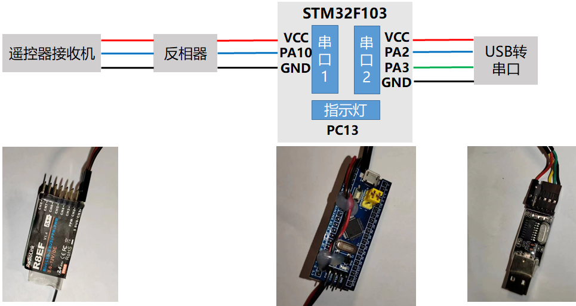

# rc_remotes
该ROS节点是利用单片机获取航模遥控器输出的SBUS信号，通过STM32F103串口2发送到ROS中。支持**航模遥控器的SBUS协议，大疆的DBUS协议**

**接口协议：**STM32向ROS端发送的接口协议可在这个链接中查看到：（https://docs.qq.com/sheet/DV2hmSEdSYVVtclB4?tab=bb08j2）,具体使用的是命令类型为0x11的指令。

**硬件连接框图如下**：占用STM32串口1和串口2两个功能资源，PC13引脚用于指示灯

# 下载安装
 1.安装依赖项

    sudo apt-get install ros-xxxx-serial

 2. cd catkin_ws/src

 3.  git clone  https://github.com/RuPingCen/rc_remotes.git

 4. catkin_make

# 参数说明

- **cmdvel_topic** (发布的话题名称)

- **dev**（串口设备名称）

- **baud**（串口波特率）

- **hz**（数据发布频率）

- **show_message**（是否打印接收机数据）

- **RC_K**（速度比例因子，默认为1，此时遥控器输出的速度为1、2、3m/s）

- **RC_MIN**（遥控器摇杆通道的最小值）

- **RC_MAX**（遥控器摇杆通道的最大值，最大值和最小用于判断遥控器输出的数据是否在这个边界范围内）

# 遥控器操作说明

遥控器与 https://mickrobot.github.io/ 中1.3和1.4节描述的遥控器操作相同

## 乐迪T8FB

1. 遥控器左上角的拨动开关为功能选择按键：置于L档，即最上方位置，表示不使能遥控器。置于H档表示由遥控器控制小车，忽略上位机命令。
2. 遥控器右上角拨动开关上中下位置分别对应小车1m/s、2m/s、3.5m/s速度。
3. 右手边摇杆竖直方向通道控制小车前后运动（如下图所示），右边的摇杆水平通道控制小车左右旋转

